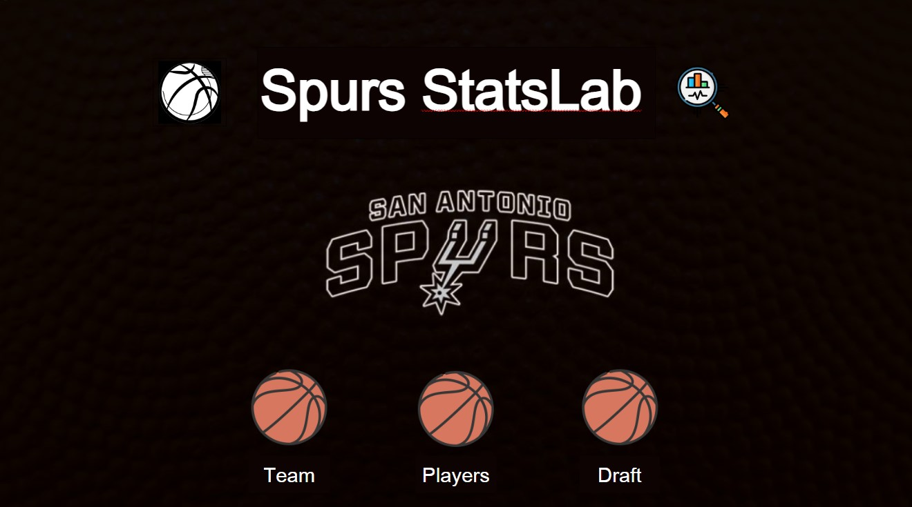
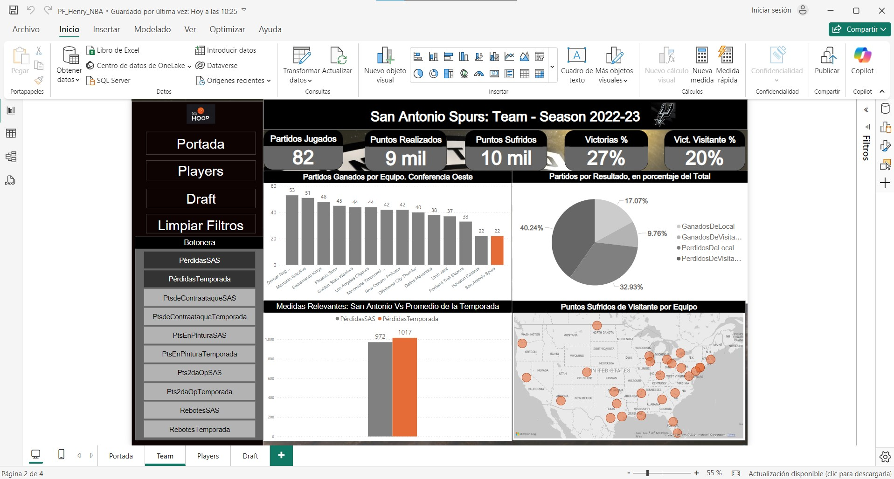
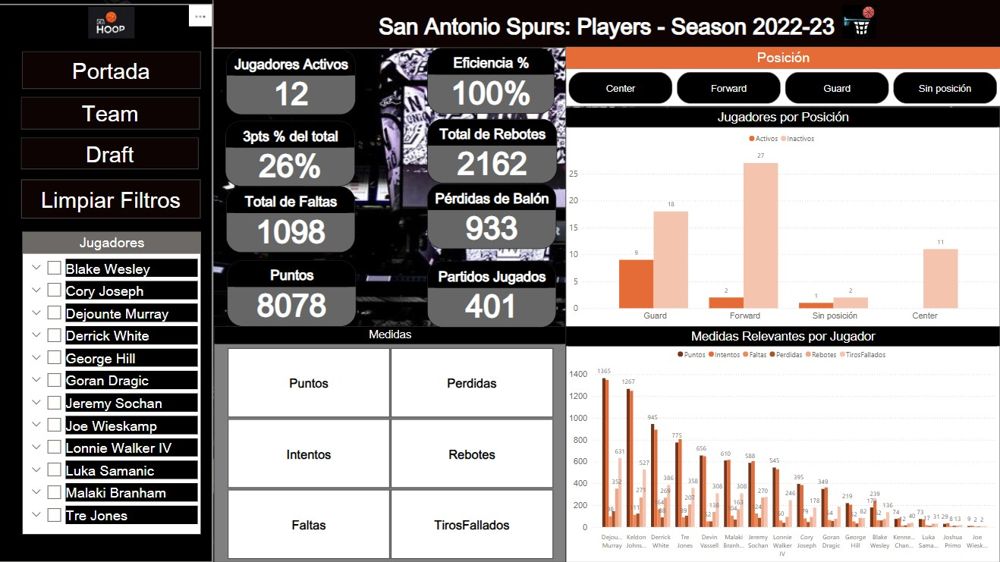
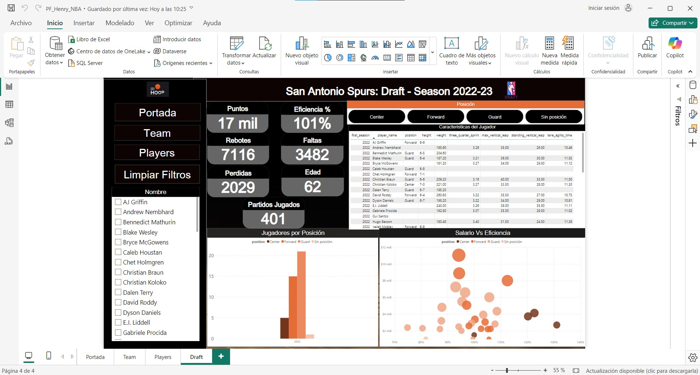

# Proyecto-Final-Henry

El proyecto Spurs StatsLab fue diseñado con el objetivo de analizar el rendimiento del equipo de la NBA San Antonio Spurs durante la temporada 2022-2023. Este análisis buscó identificar áreas de mejora, proporcionar insights accionables para decisiones estratégicas y contribuir al desarrollo competitivo del equipo, teniendo en cuenta tanto su desempeño deportivo como el impacto financiero y en los fanáticos.

  

1. Caso de Negocio

🏀 Industria y Contexto:

El análisis se enfocó en el rendimiento deportivo de los Spurs, quienes finalizaron últimos en la Conferencia Oeste. Esto impactó negativamente en sus resultados deportivos, ingresos financieros 💰 y relación con los fanáticos 💔.

Problema Central:
El bajo desempeño en la temporada no solo afectó el éxito competitivo 🏆, sino que también comprometió la relevancia financiera y deportiva de la franquicia. Resolver estas debilidades es clave para mejorar la sostenibilidad del equipo y mantener el entusiasmo de sus seguidores 🎉.

🎯 Objetivo Principal:

Crear una herramienta basada en datos que facilite decisiones en tres áreas clave:

a. Evaluación del rendimiento individual y colectivo.

b. Estrategias de mejora táctica.

c. Decisiones de mercado para reforzar el equipo.

Soluciones Propuestas:

•	Análisis comparativo con otros equipos.

•	Modelos predictivos para identificar talentos.

•	Recomendaciones tácticas y visualizaciones interactivas en Power BI.

  

2. Fuentes de Datos

📥 Origen de Datos:

Los datos provienen del dataset público NBA Database en Kaggle, que incluye más de 13 millones de filas con información histórica y actual de la NBA desde 1946 🕰️.

Cobertura:

•	Temporal: Desde la primera temporada de la NBA hasta 2023.

•	Geográfica: Los 30 equipos de la liga .

Tipos de Datos:

•	Estadísticas de jugadores 🏀.

•	Datos de equipos 🛡️.

•	Jugadas y resúmenes de partidos 📋.

3. Estrategia de Análisis

Se definió un plan de análisis dividido en seis fases:

•	📊 Resumen general del equipo: Estadísticas de victorias, puntos anotados/permitidos y eficiencia ofensiva/defensiva.

•	🤝 Análisis colectivo: Fortalezas y debilidades como equipo.

•	🏅 Rendimiento individual: Evaluación de jugadores clave según posición y contribución.

•	🚀 Oportunidades de mejora: Áreas críticas como rebotes y puntos de segunda oportunidad.

•	🛒 Análisis de mercado: Identificación de prospectos para reforzar al equipo.

•	🌟 Visualización: Dashboards en Power BI para comunicar hallazgos.

Herramientas Utilizadas: Python 🐍 y SQL para limpieza y análisis de datos. Power BI para visualizaciones interactivas 📈.

  

4. Resultados del Análisis

 📊 Equipo: San Antonio Spurs

San Antonio Spurs tuvo una temporada complicada en la NBA 2022-2023, jugando un total de 82 partidos y ganando solo 22, lo que representa un 27% de victorias. Esto lo ubicó en el último lugar de la Conferencia Oeste. A nivel de partidos, el equipo jugó la mitad de los encuentros como local y la otra mitad como visitante. En su estadio, San Antonio ganó 14 partidos (17% de victorias), mientras que fuera de casa solo logró 8 victorias (10%). Estos números reflejan las dificultades del equipo tanto en su cancha como fuera de ella.

En cuanto a los puntos anotados y recibidos, el equipo logró alrededor de 9,000 puntos, pero permitió cerca de 10,000, lo que muestra una clara disparidad en su desempeño ofensivo y defensivo. Además, San Antonio fue el equipo que más puntos sufrió como visitante, con 5,114 puntos permitidos en esos 41 partidos, lo que subraya su vulnerabilidad defensiva en situaciones fuera de casa.

Al comparar sus estadísticas con los promedios de la temporada, encontramos algunos puntos de interés. En cuanto a las pérdidas de balón, el equipo cometió 972, lo que está por debajo del promedio de la liga, que fue de 1,017. Esto indica que, a pesar de su bajo rendimiento, San Antonio fue relativamente eficiente en cuanto al control del balón. Por otro lado, el equipo anotó 1,032 puntos de contraataque, superando el promedio de la liga, que fue de 1,013, y también destacó en puntos en la pintura, con 3,700, por encima de los 3,600 puntos del promedio de la temporada.

Sin embargo, hubo áreas donde el equipo estuvo por debajo del promedio. En cuanto a los puntos de segunda oportunidad, San Antonio anotó 965, ligeramente por debajo de los 981 puntos que representa el promedio de la temporada. También tuvieron un desempeño inferior en los rebotes ofensivos, con 566 frente a los 578 del promedio general de la liga, lo que indica que les faltó eficiencia en estos aspectos clave.

Como conclusión se desprende que, San Antonio Spurs, tuvo una temporada muy difícil en términos de resultados, reflejada en su bajo porcentaje de victorias y su posición final en la Conferencia Oeste. A pesar de esto, se destacaron en algunos aspectos:

•	Puntos de contraataque y en la pintura: lograron superar los promedios generales de la temporada, mostrando cierta eficacia ofensiva en estas áreas.

•	Control del balón: cometieron menos pérdidas que el promedio de la liga, un punto positivo dentro de su rendimiento general.

Sin embargo, sus problemas defensivos fueron evidentes, especialmente como visitantes, donde recibieron la mayor cantidad de puntos de la liga. Esto, sumado a los rebotes por debajo del promedio, evidencia debilidades importantes en su juego defensivo y físico.

  

 🏅 Análisis de los Jugadores

El equipo cuenta con un total de 70 jugadores, pero solo 12 de ellos son activos. En términos de posiciones, hay 27 guards, de los cuales 9 están activos; 29 forwards, con solo 2 activos; y 11 centers, ninguno de los cuales está activo. Además, hay 3 jugadores sin posición definida, de los cuales 1 está activo.

Entre los forwards destacados, Jeremy Sochan lidera con 588 puntos, un 98% de eficiencia en tiros, 124 faltas, 84 pérdidas y 270 rebotes en 50 partidos. Por su parte, Luca Samanic, con menos participación (7 partidos), muestra una eficiencia sobresaliente del 104%, con 73 puntos, 17 faltas, 10 pérdidas y 30 rebotes.

En la posición de guard, los jugadores más relevantes son:

•	Dejounte Murray: Máximo anotador entre los guards con 1,365 puntos (18% provenientes de triples), 101% de eficiencia en tiros, 352 faltas, 145 pérdidas y 98 rebotes en 65 partidos.

•	Keldon Johnson: 1267 puntos, de los cuales 23% son triples, 271 rebotes, 111 faltas y 123 pérdidas de balón en 56 partidos jugados.

•	Derrick White: 945 puntos, un 106% de eficiencia (35% triples), 269 rebotes, 164 faltas y 88 pérdidas en 76 partidos.

•	Tre Jones: 775 puntos (12% triples), un 96% de eficiencia, 207 rebotes, 104 pérdidas y 89 faltas en 61 partidos.

En conclusión, el equipo muestra una notable escasez de forwards y centers activos, lo que podría afectar su capacidad defensiva y la lucha por los rebotes. Los guard, por el contrario, tienen un buen rendimiento y representan una fortaleza del equipo, con jugadores como Dejounte Murray y Keldon Johnson liderando en puntos y eficiencia.

  

🛒 Análisis de posibles incorporaciones

En la posición de center, se destacan cuatro:

•	Walker Kessler: Con una impresionante eficiencia del 131%, 700 puntos, 579 rebotes, 163 faltas y 53 pérdidas. Con 22 años, mide 7’0’’ y pesa 256 libras. Su salario es de USD 2,694,000.

•	Jalen Duren: Eficiencia del 123%, 579 puntos, 153 rebotes, 156 faltas y 82 pérdidas. Tiene 20 años, mide 6’11’’ y gana USD 4,140,000.

•	Mark Williams: 120% de eficiencia, 356 puntos, 266 rebotes, 81 faltas y 35 pérdidas. Con 22 años, mide 7’0’’ y pesa 242.4 libras. Su salario es de USD 3,722,000.

•	Christian Koloko: Aunque menos experimentado, tiene 100% de eficiencia, 178 puntos, 150 rebotes, 107 faltas y 18 pérdidas. Con 23 años, mide 7’0’’ y pesa 221 libras. Su salario es el más bajo entre los candidatos, USD 1,500,000.

Para la posición de forward, las opciones más destacadas son:

•	Josh Minott: Eficiencia del 106%, con 38 puntos, 22 rebotes y 8 faltas. Con 21 años, mide 6’8’’ y tiene un salario de USD 1,017,781.

•	Patrick Baldwin Jr.: Muestra una eficiencia del 106%, con 121 puntos, 38 rebotes, 15 faltas y 10 pérdidas. Tiene 21 años, mide 6’9’’ y pesa 230.8 libras, con un salario de USD 2,226,000.

•	Peyton Watson: Eficiencia del 105%, con 82 puntos, 37 rebotes, 14 faltas y 8 pérdidas. Con 21 años, mide 6’7’’ y tiene un salario de USD 2,193,960.

En conclusión, en cuanto a posibles fichajes, la posición de center cuenta con opciones prometedoras como Walker Kessler y Jalen Duren, que combinan eficiencia con una buena relación costo-rendimiento. Para forwards, Patrick Baldwin Jr. y Josh Minott destacan como jugadores jóvenes y con potencial de crecimiento, mientras que Peyton Watson podría aportar solidez adicional.

En general, las incorporaciones en las posiciones más deficitarias (forwards y centers) serían cruciales para mejorar la estructura y competitividad del equipo

  

5. Impacto Esperado del Proyecto

✨ Beneficios clave:

•	📊 Mejora en la toma de decisiones estratégicas.

•	🔍 Identificación de talentos clave para reforzar el equipo.

•	💬 Generación de insights para fortalecer la relación con los fanáticos y optimizar el desempeño deportivo.
